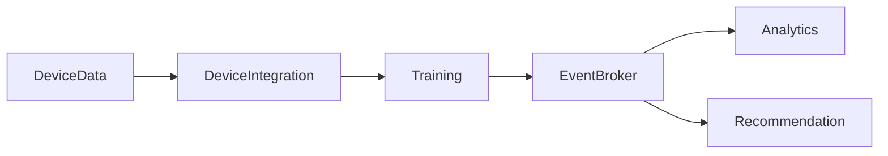
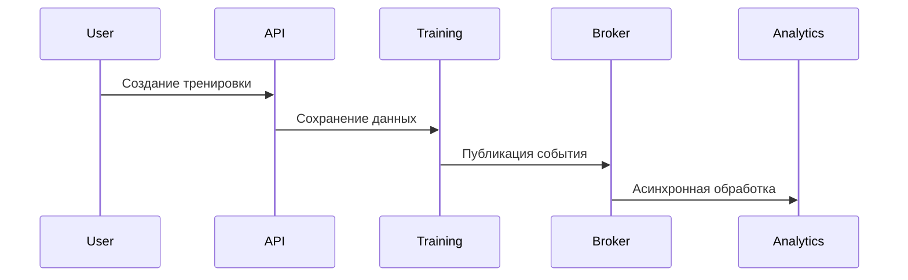
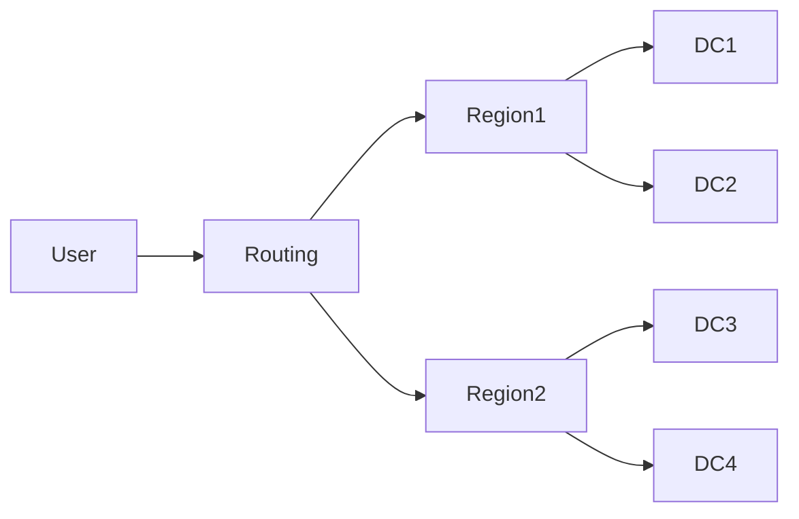

# Основные представления архитектуры

В данном документе представлены основные архитектурные представления системы Athletica, позволяющие описать систему с разных точек зрения:

- функциональной;
- информационной;
- многозадачности (concurrency — параллельное выполнение);
- инфраструктурной;
- безопасности.

Эти представления дополняют базовую архитектуру и обеспечивают целостное понимание системы.

---

## 1. Функциональное представление

Функциональное представление описывает систему с точки зрения пользовательских и бизнес-функций, а также распределения ответственности между доменами.

Система Athletica построена на основе доменного разбиения (domain-driven decomposition — разделение по бизнес-доменам) и включает следующие основные функциональные домены:

- Auth Domain — регистрация, аутентификация и управление доступом;
- Profile Domain — управление пользовательскими профилями;
- Training Domain — хранение и обработка тренировок;
- Social Domain — публикация и взаимодействие пользователей;
- Challenge and Gamification Domain — челленджи, достижения и мотивация;
- Recommendation Domain — персонализированные рекомендации;
- Notification Domain — уведомления пользователей;
- Analytics Domain — сбор и анализ данных;
- Commerce Integration Domain — интеграция с внешними источниками контента и промоакций;
- Device Integration Domain — приём и обработка данных от устройств;
- Event Broker — событийное взаимодействие между доменами.

### Основные функциональные потоки

1. Регистрация пользователя:
   Auth → Profile

2. Запись тренировки:
   Device Integration → Training → Event Broker → Analytics / Recommendation

3. Публикация поста:
   Social → Training → Event Broker

4. Генерация рекомендаций:
   Analytics + Training + Commerce → Recommendation

Функциональные домены взаимодействуют преимущественно асинхронно через Event Broker, что обеспечивает слабую связанность (loose coupling — слабая связность) и масштабируемость.

### Связанные ADR и документы

- ADR-001 — Архитектурный стиль;
- ADR-002 — Декомпозиция на домены;
- ADR-003 — Интеграционный стиль;
- use-cases (01–05);
- base-architecture.md.

---

## 2. Информационное представление

Информационное представление описывает структуру данных и их распределение между доменами.

Каждый домен владеет своими данными (data ownership — владение данными) и не имеет прямого доступа к базам данных других доменов (no cross-DB access).

### Основные сущности системы

- User — пользователь;
- Profile — профиль пользователя;
- Training — тренировка;
- Social Post — публикация;
- Challenge — челлендж;
- Recommendation — рекомендация;
- Notification — уведомление;
- Device Data — данные устройства;
- Commerce Content — внешний контент и промоакции.

### Принципы работы с данными

- каждый домен имеет собственное хранилище данных;
- обмен данными происходит через события;
- используется eventual consistency (согласованность с задержкой);
- критичные данные (Auth, Profile, Training) реплицируются между регионами;
- аналитические данные реплицируются асинхронно;
- данные синхронизируются через события, а не через прямой доступ.

### Потоки данных

### Связанные ADR и документы

- ADR-004 — Стратегия хранения данных;
- ADR-003 — Интеграционный стиль;
- base-architecture.md;
- use-cases (02, 03, 04).

---

## 3. Многозадачность (Concurrency)

Представление многозадачности описывает параллельное выполнение процессов и взаимодействие компонентов.

Система использует смешанную модель взаимодействия:

- синхронные запросы (REST API) — для пользовательских операций;
- асинхронные события — для междоменного взаимодействия.

### Основные принципы

- обработка пользовательских запросов выполняется синхронно;
- тяжёлые операции выполняются асинхронно через Event Broker;
- домены обрабатывают события независимо друг от друга;
- используется idempotency (идемпотентность — повторяемость без побочных эффектов);
- используется retry (повторные попытки выполнения);

### Поток выполнения

### Параллелизм

- события обрабатываются параллельно;
- домены масштабируются независимо;
- используется горизонтальное масштабирование (horizontal scaling — масштабирование через добавление экземпляров).

### Связанные ADR и документы

- ADR-003 — Интеграционный стиль;
- ADR-007 — Обработка событий;
- base-architecture.md;
- use-cases (02, 03, 04).

---

## 4. Инфраструктурное представление

Инфраструктурное представление описывает физическое размещение системы.

Система построена по multi-region модели:

- два географически независимых региона;
- в каждом регионе:
  - основной ЦОД;
  - резервный ЦОД (standby).

### Основные компоненты инфраструктуры

- Geo Routing — маршрутизация пользователей;
- API Gateway — точка входа в систему;
- доменные сервисы;
- Event Broker;
- базы данных;
- кэш;
- системы мониторинга и логирования.

### Принципы

- active-active между регионами;
- failover внутри региона;
- репликация данных между регионами;
- изоляция доменов;
- масштабируемость.

### Упрощённая схема

### Связанные ADR и документы

- ADR-001 — Архитектурный стиль;
- ADR-005 — Инфраструктурная модель;
- ADR-007 — Multi-region и отказоустойчивость;
- base-architecture.md.

---

## 5. Представление безопасности

Представление безопасности описывает подходы к защите системы и данных.

### Основные принципы

- все внешние взаимодействия проходят через защищённые протоколы (HTTPS/TLS);
- запрещено использование небезопасных протоколов извне;
- используется централизованная аутентификация (Auth Domain);
- реализована авторизация (RBAC — ролевая модель);
- данные шифруются при передаче и хранении;
- выполняется валидация входных данных;
- применяется rate limiting (ограничение частоты запросов);
- используется защита от повторных запросов (idempotency).

### Разделение доступа

- пользовательский доступ — через API Gateway;
- внутренние сервисы — через защищённый контур;
- устройства — через Device Integration Domain.

### Защита данных

- критичные данные реплицируются;
- используется резервное копирование;
- ведётся аудит действий пользователей;
- логируются события безопасности.

### Угрозы и защита

- защита от brute force атак;
- защита от replay атак;
- защита от DoS;
- изоляция доменов.

### Связанные ADR и документы

- ADR-006 — Стратегия безопасности;
- base-architecture.md;
- use-cases (01–05).
