# Базовая архитектура платформы Athletica

## 1. Назначение документа

Данный документ описывает базовую архитектуру платформы Athletica с учётом:

- бизнес-целей системы;
- функциональных требований;
- нефункциональных требований;
- выбранного архитектурного стиля;
- архитектурных ограничений;
- ключевых атрибутов качества.

Документ служит связующим артефактом между бизнес-требованиями, требованиями к качеству, концептуальной архитектурой и принятыми архитектурными решениями (ADR — Architecture Decision Record).

## Связь с другими артефактами

Данный документ опирается на следующие артефакты:

- vision-and-scope.md — бизнес-цели и стратегическое видение;
- requirements.md — функциональные и нефункциональные требования (ТЗ — техническое задание);
- conceptual-architecture.md — концептуальная архитектура системы;
- architecture-options.md — анализ архитектурных решений;
- risk.md — анализ рисков;
- development-roadmap.md — план развития системы;
- adr-list.md и ADR-001…ADR-007 — принятые архитектурные решения.

Документ объединяет указанные артефакты и отражает итоговую архитектурную модель системы.

---

## 2. Контекст архитектурного решения

Athletica проектируется как глобальная цифровая платформа для пользователей, ведущих спортивную активность и использующих мобильное приложение, веб-интерфейс и внешние устройства.

Платформа должна обеспечивать:

- регистрацию и аутентификацию пользователей;
- ведение профиля и спортивных целей;
- запись и хранение тренировок;
- социальное взаимодействие;
- участие в челленджах и рейтингах;
- интеграцию с носимыми устройствами и внешними партнёрами;
- персонализированные рекомендации;
- аналитику и обработку событий;
- интеграцию с коммерческой экосистемой компании;
- поддержку региональных бизнес-функций, включая региональные промоакции.

Таким образом, система сочетает:

- пользовательские транзакционные сценарии;
- асинхронную обработку событий;
- высоконагруженные интеграционные потоки;
- аналитический контур;
- требования по безопасности, отказоустойчивости и масштабируемости.

---

## 3. Влияние бизнес-требований на архитектуру

Бизнес-цели платформы требуют, чтобы архитектура поддерживала следующие возможности:

### 3.1 Независимое развитие направлений продукта

Платформа включает несколько функционально разных направлений:

- пользовательская идентификация;
- тренировки;
- социальная активность;
- рекомендации;
- аналитика;
- устройства;
- коммерческие интеграции.

Поэтому архитектура должна позволять развивать эти области независимо друг от друга.

### 3.2 Рост пользовательской базы и объёма данных

Платформа ориентирована на масштабирование и рост числа пользователей, устройств и событий. Архитектура должна поддерживать:

- горизонтальное масштабирование;
- асинхронную обработку;
- выделение отдельных контуров для высоконагруженных частей.

### 3.3 Поддержка цифровой экосистемы бренда

Athletica должна стать не отдельным приложением, а частью более широкой цифровой экосистемы компании. Это требует:

- выделенного слоя интеграций;
- поддержки внешних API (интерфейс программирования приложений);
- безопасного взаимодействия с внешними устройствами и партнёрами;
- поддержки региональных кампаний и промоакций без влияния на другие регионы;
- возможности учитывать регион как часть бизнес-контекста запроса.

---

## 4. Базовый архитектурный подход

В качестве базовой архитектуры для Athletica выбрана:

### **Микросервисная архитектура с доменной декомпозицией и комбинированной моделью взаимодействия**

Это означает:

- система разделена на отдельные домены (bounded contexts — ограниченные контексты);
- домены взаимодействуют через:
  - синхронные API;
  - асинхронный Event Broker (брокер событий);
- данные разделены по стратегии Database per Service (отдельная база данных на сервис);
- аналитическая и рекомендательная обработка вынесены в отдельный контур;
- внешние устройства используют отдельный ingress / ingestion контур (контур приёма данных);
- платформа поддерживает многорегиональное развёртывание (multi-region deployment — развёртывание в нескольких регионах);
- регион рассматривается как часть контекста пользовательского и бизнес-запроса;
- критичные данные и события могут реплицироваться между регионами с учётом eventual consistency (согласованность в конечном итоге).

---

## 5. Основные домены базовой архитектуры

Базовая архитектура включает следующие домены:

- **Auth Domain** — аутентификация, сессии, токены, базовая авторизация;
- **Profile Domain** — профиль пользователя, цели, настройки;
- **Training Domain** — тренировки, активность, история тренировок;
- **Social Domain** — публикации, социальные связи, взаимодействия;
- **Challenge and Gamification Domain** — челленджи, достижения, лидерборды;
- **Device Integration Domain** — интеграция с устройствами и партнёрскими источниками данных;
- **Recommendation Domain** — генерация и хранение рекомендаций;
- **Notification Domain** — уведомления пользователей;
- **Analytics Domain** — аналитика, агрегаты, продуктовые показатели;
- **Commerce Integration Domain** — интеграция с торговой экосистемой компании;
- **Event Broker** — инфраструктурный компонент асинхронного взаимодействия.

---

## 6. Принципы построения базовой архитектуры

### 6.1 Доменная изоляция

Каждый домен:

- владеет собственной бизнес-логикой;
- владеет собственными данными;
- развивается независимо;
- не обращается напрямую к базе данных другого домена.

### 6.2 Контрактное взаимодействие

Взаимодействие между доменами выполняется только через:

- API;
- события через Event Broker.

### 6.3 Разделение транзакционного и аналитического контуров

Транзакционные пользовательские операции не должны зависеть от тяжёлой аналитической обработки.

Поэтому:

- пользовательские сценарии работают через доменные сервисы;
- аналитика, рекомендации, агрегация и часть социальных обновлений обрабатываются асинхронно.

### 6.4 Явное разделение внешнего и внутреннего контуров

В архитектуре различаются:

- внешний контур пользовательского API;
- внутренний доменный контур;
- интеграционный контур устройств;
- аналитический контур;
- региональный контур развёртывания, в котором каждый регион может обслуживать собственный трафик и бизнес-функции.

### 6.5 Безопасность как архитектурный принцип

Безопасность реализуется не точечно, а как часть архитектуры:

- централизованная аутентификация;
- доменный контроль доступа;
- защищённые внешние протоколы;
- отсутствие прямого доступа к данным другого домена;
- ограничения на обработку чувствительных данных.

---

## 7. Ограничения, влияющие на базовую архитектуру

### 7.0 Геораспределённость и региональность

Платформа должна поддерживать работу в нескольких регионах (regions — географические регионы) и дата-центрах (ЦОД — центр обработки данных). Это необходимо для:

- снижения задержек (latency — задержка) для пользователей;
- поддержки региональных бизнес-функций;
- обеспечения отказоустойчивости;
- соблюдения локальных требований к данным и контенту.

Система должна учитывать:

- маршрутизацию пользователей в ближайший или назначенный регион;
- возможность вставки региональных промоакций;
- изоляцию региональных кампаний и контента;
- возможность аварийного переключения между регионами.

### 7.0.1 Количество ЦОД и модель размещения

Для обеспечения отказоустойчивости, производительности и безопасности система должна использовать как минимум:

- два географически независимых региона;
- в каждом регионе — не менее одного ЦОД (центр обработки данных);
- предпочтительно — два ЦОД в критичных регионах (active-active или active-passive конфигурация).

Рекомендуемая минимальная модель:

- Регион 1:
  - ЦОД 1 (основной);
  - ЦОД 2 (резервный);
- Регион 2:
  - ЦОД 3 (основной);
  - ЦОД 4 (резервный).

Между регионами используется модель active-active (оба региона активны), при которой пользовательский трафик может обслуживаться в любом из регионов. Внутри каждого региона используется модель основной/резервный ЦОД для быстрого failover (переключение при сбое) на уровне инфраструктуры.

---

### 7.0.2 Механизмы отказоустойчивости и быстрого переключения

Для обеспечения быстрого и безопасного реагирования используются следующие механизмы:

#### 1. Geo Routing (географическая маршрутизация)

- пользователь направляется в ближайший регион;
- при недоступности региона трафик автоматически переключается на другой регион;
- используется DNS или глобальный балансировщик нагрузки.

#### 2. Failover (переключение при сбое)

- при отказе ЦОД внутри региона происходит переключение на резервный ЦОД;
- при отказе региона происходит переключение на другой регион;
- переключение выполняется автоматически на уровне инфраструктуры.

#### 3. Репликация данных

- критичные данные (Auth, Profile) реплицируются между регионами;
- аналитические данные реплицируются асинхронно;
- события синхронизируются между Event Broker разных регионов;
- используется eventual consistency.

#### 4. Изоляция отказов

- сбой одного домена или региона не приводит к полной недоступности системы;
- система продолжает работать в деградированном режиме;
- критичные сценарии остаются доступными.

#### 5. Health checks и автоматическое восстановление

- сервисы регулярно проверяются (health checks);
- при сбое происходит автоматический рестарт или перераспределение нагрузки;
- оркестратор (например Kubernetes) управляет восстановлением.

---

### 7.0.3 Как это работает в реальности (пошагово)

1. Пользователь отправляет запрос.
2. Geo Routing направляет его в ближайший регион.
3. Если регион доступен — запрос обрабатывается локально.
4. Если регион недоступен — запрос перенаправляется в другой регион.
5. Если внутри региона падает ЦОД — происходит переключение на резервный ЦОД.
6. Данные синхронизируются между регионами через репликацию и события.
7. Система продолжает работу без полной остановки.

### 7.1 Ограничения бизнес-требований

- система должна быть масштабируемой на глобальном уровне;
- развитие платформы должно идти поэтапно;
- платформа должна поддерживать работу с устройствами и внешними интеграциями;
- решение должно быть пригодно для роста цифровой экосистемы;
- платформа должна поддерживать региональные промоакции и регионально-зависимый контент;
- архитектура должна учитывать возможность работы в нескольких регионах и ЦОД.

### 7.2 Ограничения нефункциональных требований

- высокая доступность;
- устойчивость к сбоям;
- наблюдаемость;
- безопасная обработка персональных данных;
- ограничение связанности;
- независимое масштабирование сервисов;
- управляемость инфраструктуры;
- репликация данных между регионами;
- поддержка аварийного восстановления (Disaster Recovery — восстановление после сбоев);
- снижение задержек для пользователей из разных регионов.

### 7.3 Ограничения архитектурных решений

Согласно принятым ADR:

- используется микросервисный подход;
- домены изолированы;
- применяется Database per Service;
- используется Event Broker;
- наблюдаемость строится на logs (логи), metrics (метрики), tracing (распределённая трассировка);
- безопасность строится на Auth Domain + доменном контроле доступа;
- инфраструктура поддерживает горизонтальное масштабирование и multi-region развитие;
- архитектура должна поддерживать многорегиональное развёртывание, репликацию и аварийное переключение;
- регион может влиять на выдачу контента и бизнес-логику, включая региональные промоакции.

---

## 8. Адресация атрибутов качества

### 8.1 Масштабируемость

Адресуется через:

- микросервисную архитектуру;
- независимое масштабирование доменов;
- асинхронную обработку;
- Event Broker;
- отдельный контур интеграции устройств;
- отдельный аналитический слой.

### 8.2 Отказоустойчивость

Адресуется через:

- изоляцию доменов;
- асинхронные взаимодействия;
- повторную доставку событий;
- возможность независимого восстановления отдельных частей;
- multi-region стратегию развёртывания;
- репликацию данных между регионами;
- аварийное переключение (failover — переключение при сбое) между регионами;
- возможность работы системы в деградированном режиме при отказе части компонентов.

### 8.3 Производительность

Адресуется через:

- разделение синхронных и асинхронных сценариев;
- отсутствие тяжёлой аналитики в транзакционном контуре;
- предварительную генерацию рекомендаций;
- отдельный ingestion-контур для устройств;
- маршрутизацию пользователей в ближайший регион для сокращения задержек;
- локализацию части регионально-зависимых данных и контента.

### 8.4 Безопасность

Адресуется через:

- централизованную аутентификацию через Auth Domain;
- доменную авторизацию;
- защищённые протоколы HTTPS (защищённый HTTP) и TLS (Transport Layer Security — протокол шифрования транспортного уровня) для внешнего контура;
- контроль доверенных интеграций;
- запрет прямого доступа к данным другого домена;
- ограничение раскрытия ошибок внешнему клиенту.

### 8.5 Наблюдаемость

Адресуется через:

- логирование;
- метрики;
- трассировку;
- correlation-id (идентификатор корреляции);
- контроль событийных потоков;
- мониторинг критичных доменов и интеграций.

### 8.6 Гибкость развития

Адресуется через:

- bounded contexts;
- ADR;
- roadmap с поэтапным вводом доменов;
- контрактное взаимодействие;
- независимые изменения схем данных.

### 8.7 Региональность

Адресуется через:

- передачу региона как части контекста запроса;
- поддержку регионально-зависимого контента и промоакций;
- возможность независимого управления региональными кампаниями;
- изоляцию региональных изменений без влияния на другие регионы.

### 8.8 Восстановление после сбоев

Адресуется через:

- репликацию данных и событий между регионами;
- резервный регион или несколько активных регионов;
- стратегию Disaster Recovery для критичных компонентов;
- возможность маршрутизации трафика при отказе региона.

---

## 9. Базовая логическая схема критичных multi-region компонентов

```mermaid
flowchart LR
    Users[Пользовательские клиенты] --> Routing[Geo Routing и API Gateway]
    Devices[Устройства и партнёры] --> DeviceIntegration[Device Integration Domain]

    Routing --> Region1[Регион 1]
    Routing --> Region2[Регион 2]

    subgraph R1[Регион 1 active-active]
        subgraph DC1[ЦОД 1 — основной]
            Auth1[Auth Domain]
            Profile1[Profile Domain]
            Training1[Training Domain]
            Social1[Social Domain]
            Challenge1[Challenge and Gamification Domain]
            Recommendation1[Recommendation Domain]
            Notification1[Notification Domain]
            Analytics1[Analytics Domain]
            Commerce1[Commerce Integration Domain]
            Broker1[Event Broker]
        end

        subgraph DC2[ЦОД 2 — резервный]
            Auth1b[Auth Domain]
            Profile1b[Profile Domain]
            Training1b[Training Domain]
            Social1b[Social Domain]
            Challenge1b[Challenge and Gamification Domain]
            Recommendation1b[Recommendation Domain]
            Notification1b[Notification Domain]
            Analytics1b[Analytics Domain]
            Commerce1b[Commerce Integration Domain]
            Broker1b[Event Broker]
        end
    end

    subgraph R2[Регион 2 active-active]
        subgraph DC3[ЦОД 3 — основной]
            Auth2[Auth Domain]
            Profile2[Profile Domain]
            Training2[Training Domain]
            Social2[Social Domain]
            Challenge2[Challenge and Gamification Domain]
            Recommendation2[Recommendation Domain]
            Notification2[Notification Domain]
            Analytics2[Analytics Domain]
            Commerce2[Commerce Integration Domain]
            Broker2[Event Broker]
        end

        subgraph DC4[ЦОД 4 — резервный]
            Auth2b[Auth Domain]
            Profile2b[Profile Domain]
            Training2b[Training Domain]
            Social2b[Social Domain]
            Challenge2b[Challenge and Gamification Domain]
            Recommendation2b[Recommendation Domain]
            Notification2b[Notification Domain]
            Analytics2b[Analytics Domain]
            Commerce2b[Commerce Integration Domain]
            Broker2b[Event Broker]
        end
    end

    DeviceIntegration --> Training1
    DeviceIntegration --> Training2

    Training1 --> Broker1
    Social1 --> Broker1
    Challenge1 --> Broker1
    Broker1 --> Analytics1
    Broker1 --> Recommendation1
    Broker1 --> Notification1

    Training2 --> Broker2
    Social2 --> Broker2
    Challenge2 --> Broker2
    Broker2 --> Analytics2
    Broker2 --> Recommendation2
    Broker2 --> Notification2

    Commerce1 --> Recommendation1
    Commerce2 --> Recommendation2

    DC1 -. failover .-> DC2
    DC3 -. failover .-> DC4

    Auth1 <-. репликация .-> Auth2
    Profile1 <-. репликация .-> Profile2
    Training1 <-. репликация .-> Training2
    Broker1 <-. синхронизация событий .-> Broker2
    Analytics1 <-. асинхронная репликация .-> Analytics2
```

### 9.1 Пояснение к многорегиональной схеме

Диаграмма выше показывает полную логическую схему multi-region архитектуры платформы Athletica. В ней отражены все основные домены системы, их событийные взаимодействия, интеграционный контур устройств, а также модель размещения по регионам и ЦОД.

Между регионами используется active-active модель: оба региона обслуживают пользовательский трафик и участвуют в работе системы. Это позволяет снижать задержки и повышать доступность.

Внутри каждого региона используются два ЦОД:

- основной ЦОД;
- резервный ЦОД.

При отказе основного ЦОД внутри региона используется failover на резервный ЦОД.

При отказе всего региона трафик перенаправляется в другой регион с помощью Geo Routing.

Критичные транзакционные данные, включая Auth Domain, Profile Domain и Training Domain, реплицируются между регионами для обеспечения низкого RPO и поддержки аварийного переключения.

Event Broker синхронизирует события между регионами, а аналитические данные реплицируются асинхронно.

Такой подход позволяет:

- поддерживать региональные бизнес-функции и региональные промоакции;
- снижать задержки для пользователей;
- обеспечивать отказоустойчивость на уровне ЦОД и регионов;
- выполнять аварийное переключение без полной недоступности системы.

---

---

## 9.2 SLA / RTO / RPO

### Обоснование SLA / RTO / RPO

Целевые показатели SLA, RTO и RPO определены на основе:

- нефункциональных требований (requirements.md);
- анализа критичности доменов и пользовательских сценариев;
- выбранной архитектуры (event-driven — событийно-ориентированная архитектура);
- многорегиональной модели (multi-region deployment — развёртывание в нескольких регионах);
- требований к отказоустойчивости и пользовательскому опыту.

Критичность компонентов:

- критичные компоненты (Auth, Event Broker) — обеспечивают доступ и целостность данных;
- транзакционные домены (Training, Profile) — влияют на пользовательский опыт;
- вторичные домены (Social, Recommendation, Analytics) — допускают деградацию.

Это соответствует стратегии cost-aware scaling (масштабирование с учётом стоимости инфраструктуры).

Для обеспечения управляемой отказоустойчивости и предсказуемого восстановления система Athletica определяет целевые показатели SLA, RTO и RPO.

- SLA (Service Level Agreement — уровень доступности сервиса);
- RTO (Recovery Time Objective — целевое время восстановления);
- RPO (Recovery Point Objective — допустимая потеря данных).

| Компонент | SLA | RTO | RPO | Примечание |
|----------|-----|-----|-----|-----------|
| Geo Routing / DNS layer | 99.99% | ≤ 5 минут | 0 | критично для межрегионального переключения |
| API Gateway | 99.9% | ≤ 5 минут | 0 | критичная точка входа |
| Auth Domain | 99.99% | ≤ 5 минут | 0 | критичные данные пользователя |
| Profile Domain | 99.9% | ≤ 10 минут | ≤ 1 минута | репликация между регионами |
| Training Domain | 99.9% | ≤ 10 минут | ≤ 1 минута | репликация между регионами + возможна повторная отправка событий |
| Social Domain | 99.5% | ≤ 15 минут | ≤ 5 минут | допустима деградация |
| Recommendation Domain | 99.5% | ≤ 30 минут | ≤ 10 минут | eventual consistency |
| Analytics Domain | 99.0% | ≤ 1 час | ≤ 15 минут | не критичен для онлайн-сценариев |
| Notification Domain | 99.5% | ≤ 15 минут | ≤ 5 минут | возможна задержка доставки |
| Device Integration Domain | 99.9% | ≤ 10 минут | ≤ 1 минута | поддержка retry и idempotency |
| Event Broker | 99.99% | ≤ 5 минут | 0 | гарантированная доставка событий |

## 10. Почему базовая архитектура выбрана именно такой

Выбранная базовая архитектура является компромиссом между требованиями бизнеса, нефункциональными требованиями, ограничениями инфраструктуры и необходимостью дальнейшего масштабирования платформы.

Архитектура сознательно спроектирована как полная multi-region модель с явным отражением всех взаимодействующих доменов, чтобы избежать скрытых компонентов и обеспечить прозрачность для проектирования, эксплуатации и защиты решения.

Она ориентирована не только на текущий объём системы, но и на её развитие как глобальной цифровой платформы с поддержкой региональности, интеграций, аналитики и отказоустойчивости.

- поддерживает независимое развитие направлений продукта;
- обеспечивает масштабируемость и отказоустойчивость;
- поддерживает асинхронные сценарии и интеграции;
- обеспечивает безопасность и наблюдаемость;
- поддерживает разделение транзакционного и аналитического контуров;
- требуется поддержка региональных промоакций и регионально-зависимого контента;
- важно обеспечить репликацию и аварийное восстановление при отказе региона или ЦОД.

---

## 11. Вывод

Такой подход позволяет удовлетворить бизнес-цели платформы, поддерживать масштабирование, обеспечивать безопасность, наблюдаемость, гибкость развития системы, а также поддерживать региональные бизнес-функции, репликацию данных и восстановление после отказов регионов и дата-центров.
