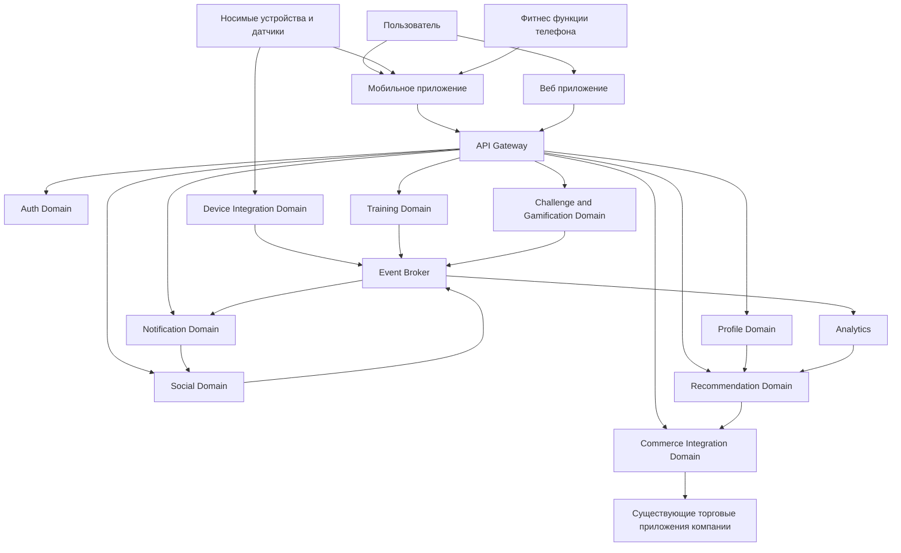

# Conceptual Architecture

## 1. Назначение документа

Данный документ описывает концептуальную архитектуру системы Athletica.  
Его цель — показать основные домены системы, границы ответственности, взаимодействие внутренних компонентов и связи с внешними системами.

Концептуальная архитектура используется для согласования общего подхода к построению системы до перехода к детальной проработке функционального, информационного, инфраструктурного и безопасностного представлений.

---

## 2. Архитектурный подход

Athletica проектируется как распределённая модульная платформа на основе микросервисной архитектуры (microservices architecture — архитектурный стиль, при котором система состоит из набора независимых сервисов, реализующих отдельные бизнес-функции).

Такой подход выбран по следующим причинам:

- система должна развиваться по нескольким направлениям одновременно: тренировки, социальные функции, устройства, рекомендации, интеграция с продажами;
- ожидается глобальный рост числа пользователей и данных;
- разные команды компании могут разрабатывать независимые части платформы;
- часть функций требует высокой скорости развития и возможности экспериментировать с технологиями;
- система должна легко интегрироваться с существующими приложениями компании и внешними устройствами.

Для взаимодействия между компонентами применяется смешанный подход:

- синхронные вызовы через API (Application Programming Interface — программный интерфейс приложения) для пользовательских запросов и критичных операций;
- асинхронное взаимодействие через события (event-driven architecture — событийно-ориентированная архитектура) через Event Broker (брокер событий) для уведомлений, аналитики, социальных обновлений, рекомендаций и обработки телеметрии устройств.

---

## 3. Bounded Context и доменные границы

При проектировании Athletica используется подход Domain-Driven Design DDD — предметно-ориентированное проектирование. На концептуальном уровне система разделяется на несколько Bounded Context — ограниченных контекстов, внутри которых используется собственная модель данных, собственные бизнес-правила и своя терминология.

Использование Bounded Context позволяет:

- уменьшить связанность между частями системы;
- изолировать изменения бизнес-правил в пределах конкретного домена;
- упростить разделение ответственности между командами;
- избежать смешивания моделей аутентификации, тренировок, социальных функций, аналитики и коммерческой интеграции.

В рамках Athletica выделяются следующие основные ограниченные контексты:

- Auth Context;
- Profile Context;
- Training Context;
- Social Context;
- Challenge and Gamification Context;
- Device Integration Context;
- Recommendation Context;
- Notification Context;
- Commerce Integration Context;
- Analytics Context.

Каждый из этих контекстов в дальнейшем может быть реализован как один или несколько сервисов, но на концептуальном уровне важно зафиксировать именно бизнес-границы, а не техническое количество сервисов.

---

## 4. Основные домены системы

На концептуальном уровне система состоит из следующих основных доменов.

### 3.1 Auth Domain
Домен аутентификации и авторизации пользователя.

Отвечает за:
- регистрация пользователя;
- аутентификацию и авторизацию;
- управление сессиями и токенами доступа;
- восстановление доступа;
- управление безопасностью учетной записи.

### 3.2 Profile Domain
Домен профиля пользователя.

Отвечает за:
- хранение и управление профилем пользователя;
- спортивные цели;
- уровень подготовки;
- интересы пользователя;
- базовые пользовательские настройки.

### 3.3 Training Domain
Домен тренировок и физической активности.

Отвечает за:
- создание и хранение тренировок;
- запись активности;
- обработку маршрутов, времени, темпа, дистанции;
- хранение истории тренировок;
- сравнение текущих результатов с прошлыми.

### 3.4 Social Domain
Социальный домен.

Отвечает за:
- группы по интересам;
- подписки и связи между пользователями;
- публикацию достижений;
- комментарии, реакции, социальные активности;
- совместные тренировки и участие в сообществах.

### 3.5 Challenge and Gamification Domain
Домен соревнований и геймификации.

Отвечает за:
- челленджи;
- лидерборды;
- очки, бейджи, достижения;
- соревновательные механики;
- сравнение с друзьями, группой, регионом, профессиональными спортсменами.

### 3.6 Device Integration Domain
Домен интеграции устройств.

Отвечает за:
- подключение внешних устройств;
- получение телеметрии;
- синхронизацию с фитнес-функциями мобильных телефонов;
- обработку данных от датчиков сердечного ритма, кислорода и других устройств.

### 3.7 Recommendation Domain
Домен рекомендаций.

Отвечает за:
- персонализированные рекомендации тренировок;
- рекомендации спортивного инвентаря;
- предложения по замене обуви и снаряжения;
- персонализированные промоакции и контент.

### 3.8 Notification Domain
Домен уведомлений.

Отвечает за:
- push-уведомления;
- уведомления друзьям о достижениях;
- уведомления о челленджах, событиях и тренировках;
- уведомления о промоакциях и региональных активностях.

### 3.9 Commerce Integration Domain
Домен интеграции с торговой экосистемой компании.

Отвечает за:
- интеграцию с существующими приложениями компании для покупки товаров;
- передачу контекста интересов и активности;
- отображение релевантных товаров;
- поддержку региональных промоакций.

### 3.10 Analytics Domain
Домен аналитики.

Отвечает за:
- агрегирование данных активности;
- сравнительный анализ результатов;
- региональные сравнения;
- поведенческую аналитику;
- поддержку рекомендательных моделей и бизнес-аналитики.

### 3.11 Event Broker
Инфраструктурный компонент асинхронного взаимодействия между доменами.

Отвечает за:
- передачу доменных событий между компонентами системы;
- снижение связанности между доменами;
- поддержку асинхронной обработки уведомлений, аналитики, рекомендаций и социальной активности;
- буферизацию и доставку событий в распределённой системе.

---

## 5. Внешние системы и интеграции

Система взаимодействует со следующими внешними источниками и платформами:

- мобильные приложения;
- веб-клиенты;
- фитнес-функции мобильных телефонов;
- носимые устройства и спортивные датчики;
- существующие приложения электронной коммерции компании;
- внешние push-провайдеры;
- внешние аналитические и маркетинговые платформы.

---

## 6. Концептуальная схема

---

## 7. Ключевые потоки взаимодействия

### 7.1 Пользовательская тренировка
Пользователь запускает тренировку через мобильное приложение.  
Данные тренировки передаются в Training Domain, где сохраняются и анализируются.  
При наличии подключенных устройств телеметрия поступает через Device Integration Domain и дополняет данные тренировки.  
Событие о завершении тренировки передаётся через Event Broker, после чего Analytics Domain использует его для анализа и формирования рекомендаций.

### 7.2 Социальное взаимодействие
После завершения тренировки пользователь может опубликовать результат.  
Social Domain обрабатывает публикацию, а событие о новой активности передаётся через Event Broker в Notification Domain, который уведомляет друзей и подписчиков о новом достижении.

### 7.3 Персональные рекомендации
Analytics Domain получает события о тренировках и активности пользователя через Event Broker и анализирует историю тренировок, активность пользователя и статистику поведения.  
На основе этих данных Recommendation Domain формирует рекомендации тренировок, экипировки и персонализированных предложений.

### 7.4 Участие в соревнованиях
Пользователь может вступать в челленджи.  
Challenge and Gamification Domain отслеживает прогресс пользователя, обновляет лидерборды и отображает результаты соревнований.

### 7.5 Интеграция с торговой экосистемой
Recommendation Domain может передавать информацию о потребностях пользователя в Commerce Integration Domain.  
Этот домен взаимодействует с существующими торговыми приложениями компании и предоставляет пользователю релевантные предложения.

---

## 8. Границы ответственности доменов

Каждый домен системы имеет чётко определённую область ответственности.

- Auth Domain управляет аутентификацией, авторизацией, сессиями и безопасностью учетных записей.
- Profile Domain управляет профилем пользователя, спортивными целями, интересами и пользовательскими настройками.
- Training Domain отвечает за тренировочную активность и историю тренировок.
- Social Domain управляет социальными взаимодействиями пользователей.
- Challenge and Gamification Domain реализует соревнования и игровые механики.
- Device Integration Domain обрабатывает данные внешних устройств.
- Recommendation Domain формирует персонализированные рекомендации.
- Notification Domain отвечает за доставку уведомлений.
- Commerce Integration Domain обеспечивает интеграцию с торговыми сервисами компании.
- Analytics Domain агрегирует данные и обеспечивает аналитическую обработку.
- Event Broker обеспечивает асинхронную передачу событий между доменами и снижает связанность системы.

Такое разделение снижает связанность компонентов системы, упрощает масштабирование и позволяет независимым командам развивать разные части платформы.

---

## 9. Вывод

Концептуальная архитектура Athletica строится как модульная распределённая платформа, объединяющая управление пользователями, тренировки, социальные взаимодействия, устройства, рекомендации и интеграцию с торговой экосистемой компании.

Доменное разделение системы позволяет масштабировать платформу, независимо развивать функциональные области и обеспечивать гибкость при внедрении новых возможностей.
