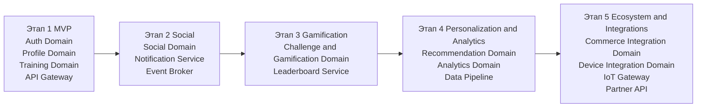

# План поэтапного развития платформы Athletica

Данный документ описывает поэтапный план развития платформы Athletica. План учитывает бизнес-цели системы, архитектурные ограничения, риски реализации и постепенное наращивание функциональности.

Главный принцип развития платформы — поэтапное внедрение функциональности с проверкой бизнес-гипотез и постепенным масштабированием архитектуры.

---

# Диаграмма эволюции архитектуры

Ниже показано, как архитектура Athletica развивается по этапам: от базовой платформы для отслеживания тренировок к полноценной глобальной спортивной экосистеме.

Диаграмма показывает, что архитектура расширяется постепенно: сначала реализуются критически важные пользовательские функции, затем социальный контур, далее механики удержания, аналитика и персонализация, и только после этого — полная интеграция с внешней экосистемой компании и устройствами.

---

# Этап 1. MVP платформы (Minimal Viable Product — минимально жизнеспособный продукт)

Цель этапа — создать минимальную версию системы, позволяющую пользователям регистрироваться, отслеживать физическую активность и сохранять результаты тренировок.

## Основной функционал

- регистрация и аутентификация пользователей;
- управление профилем пользователя;
- запись и хранение тренировок;
- интеграция с базовыми устройствами отслеживания активности;
- отображение истории тренировок;
- базовые уведомления.

## Архитектурные компоненты

- Auth Domain (домен аутентификации);
- Profile Domain (домен пользовательского профиля);
- Activity / Training Domain (домен тренировочной активности);
- базовая инфраструктура API Gateway;
- база данных пользователей и тренировок.

## Основная задача этапа

Проверка ключевой бизнес-гипотезы — пользователи готовы использовать приложение для отслеживания спортивной активности.

---

# Этап 2. Социальные функции платформы

Цель этапа — формирование спортивного сообщества пользователей вокруг платформы.

## Основной функционал

- подписки на других пользователей;
- публикация результатов тренировок;
- лайки и комментарии;
- лента активности пользователей;
- уведомления о социальной активности.

## Архитектурные компоненты

- Social Domain (домен социальных взаимодействий);
- Notification Service (сервис уведомлений);
- Event Broker (брокер событий) для публикации событий активности.

## Основная задача этапа

Увеличение вовлечённости пользователей и времени использования приложения.

---

# Этап 3. Геймификация и соревнования

Цель этапа — повысить мотивацию пользователей к регулярным тренировкам.

## Основной функционал

- челленджи и соревнования;
- лидерборды (таблицы лидеров);
- достижения и награды;
- персональные цели тренировок.

## Архитектурные компоненты

- Gamification Domain (домен геймификации);
- Leaderboard Service (сервис рейтингов);
- использование событийной архитектуры для обновления результатов.

## Основная задача этапа

Повышение удержания пользователей и формирование долгосрочной пользовательской активности.

---

# Этап 4. Персонализация и аналитика

Цель этапа — использование данных пользователей для формирования персонализированного опыта.

## Основной функционал

- персональные рекомендации тренировок;
- анализ активности пользователей;
- рекомендации спортивных товаров;
- персонализированные уведомления.

## Архитектурные компоненты

- Recommendation Service (сервис рекомендаций);
- Analytics Platform (платформа аналитики);
- Data Pipeline (конвейер обработки данных);
- хранение аналитических данных.

## Основная задача этапа

Использование данных для повышения ценности платформы и улучшения пользовательского опыта.

---

# Этап 5. Экосистема и интеграции

Цель этапа — интеграция платформы с экосистемой продуктов компании.

## Основной функционал

- интеграция с интернет-магазином спортивных товаров;
- интеграция с внешними спортивными сервисами;
- расширенная интеграция с устройствами IoT (Internet of Things — интернет вещей);
- партнёрские интеграции.

## Архитектурные компоненты

- Integration Layer (слой интеграций);
- Partner API (API партнёров);
- IoT Gateway (шлюз устройств интернета вещей);
- система управления интеграциями.

## Основная задача этапа

Создание полноценной цифровой экосистемы вокруг бренда.

---

# Таблица зависимости этапов и доменов

Ниже приведена таблица, показывающая, какие домены и ключевые архитектурные компоненты вводятся на каждом этапе развития платформы.

| Этап | Основные домены и компоненты | Архитектурная цель этапа |
|---|---|---|
| Этап 1. MVP | Auth Domain, Profile Domain, Training Domain, API Gateway | Запуск базовой платформы и проверка ключевой продуктовой гипотезы |
| Этап 2. Социальные функции | Social Domain, Notification Service, Event Broker | Формирование пользовательского сообщества и рост вовлечённости |
| Этап 3. Геймификация и соревнования | Challenge and Gamification Domain, Leaderboard Service | Повышение удержания и развитие соревновательных механик |
| Этап 4. Персонализация и аналитика | Recommendation Domain, Analytics Domain, Data Pipeline | Создание персонализированного пользовательского опыта |
| Этап 5. Экосистема и интеграции | Commerce Integration Domain, Device Integration Domain, IoT Gateway, Partner API | Расширение платформы до полноценной цифровой экосистемы |

Эта таблица показывает, что развитие платформы идёт от базовых доменов к доменам, формирующим дополнительную ценность: социальной активности, геймификации, аналитики и коммерческой интеграции. Такой подход снижает риск преждевременного усложнения архитектуры и позволяет масштабировать платформу последовательно.

---

# Общие архитектурные принципы развития

При реализации каждого этапа должны соблюдаться следующие принципы:

- постепенное развитие архитектуры без радикальных изменений;
- проверка бизнес-гипотез на ранних этапах;
- масштабируемость архитектуры;
- наблюдаемость системы (логи, метрики, трассировки);
- безопасность и защита пользовательских данных;
- контроль стоимости инфраструктуры.

---

# Связь roadmap с архитектурой системы

Roadmap напрямую связан с концептуальной архитектурой платформы:

- каждый этап добавляет новые домены системы;
- архитектура расширяется за счёт новых сервисов;
- инфраструктура масштабируется вместе с ростом нагрузки.

Такой подход позволяет постепенно развивать систему, снижая архитектурные и бизнес-риски.
