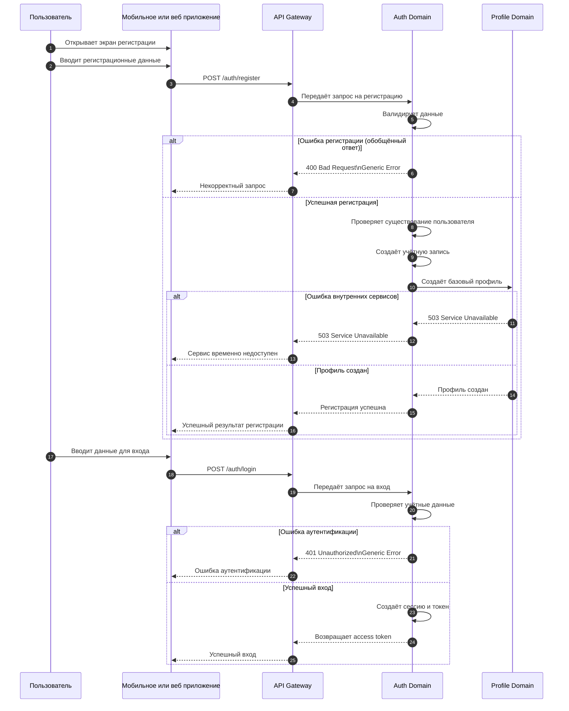

# Use Case 01 — Регистрация и вход пользователя

## Описание

Сценарий описывает процесс регистрации нового пользователя в платформе Athletica и его последующего входа в систему.

Этот сценарий является точкой входа пользователя в платформу и затрагивает базовые функции идентификации, аутентификации и создания пользовательского профиля.

---

## Цель сценария

Обеспечить пользователю возможность:

- создать учётную запись;
- пройти аутентификацию;
- получить доступ к платформе;
- создать базовый профиль для дальнейшего использования системы.

---

## Участники

- Пользователь;
- API Gateway (шлюз API);
- Auth Domain (домен аутентификации);
- Profile Domain (домен профиля пользователя).

---

## Предусловия

- пользователь ещё не зарегистрирован в системе;
- API Gateway доступен;
- Auth Domain и Profile Domain доступны;
- пользователь использует мобильное приложение или веб-интерфейс.

---

## Основной поток

### Часть 1. Регистрация

1. Пользователь открывает экран регистрации.
2. Пользователь вводит регистрационные данные.
3. Клиентское приложение отправляет запрос на регистрацию через API Gateway.
4. API Gateway передаёт запрос в Auth Domain.
5. Auth Domain:
   - валидирует данные;
   - проверяет, что пользователь ещё не существует;
   - создаёт учётную запись;
   - сохраняет данные аутентификации.
6. После успешного создания учётной записи Auth Domain инициирует создание базового профиля пользователя в Profile Domain.
7. Profile Domain создаёт базовый профиль пользователя.
8. Система возвращает пользователю успешный результат регистрации.

### Часть 2. Вход в систему

1. Пользователь вводит данные для входа.
2. Клиентское приложение отправляет запрос через API Gateway.
3. API Gateway передаёт запрос в Auth Domain.
4. Auth Domain:
   - проверяет учётные данные;
   - создаёт сессию;
   - выдаёт токен доступа.
5. Пользователь получает токен и авторизуется в системе.

---

## Альтернативные потоки

### A1. Ошибка регистрации (обобщённый ответ)

Если запрос на регистрацию не может быть обработан, система возвращает обобщённую ошибку без раскрытия причины.

- HTTP status: 400 Bad Request;
- Message: Некорректный запрос.

---

### A2. Ошибка аутентификации

Если пользователь вводит неверные данные для входа, Auth Domain отклоняет запрос и возвращает обобщённую ошибку без раскрытия причины.

- HTTP status: 401 Unauthorized;
- Message: Ошибка аутентификации.

---

### A3. Ошибка внутренних сервисов

Если Auth Domain, Profile Domain или иная внутренняя зависимость недоступны, система возвращает ошибку недоступности сервиса.

- HTTP status: 503 Service Unavailable;
- Message: Сервис временно недоступен.

---

## Постусловия

При успешном завершении сценария:

- в Auth Domain создана учётная запись пользователя;
- в Profile Domain создан базовый профиль пользователя;
- пользователь получил токен доступа;
- пользователь может использовать функции платформы в соответствии со своими правами.

---

## Архитектурные аспекты

Сценарий подтверждает следующие архитектурные решения:

- аутентификация централизована в Auth Domain;
- профиль пользователя отделён от домена аутентификации;
- взаимодействие между клиентом и доменами выполняется через API Gateway;
- данные Auth Domain и Profile Domain разделены согласно стратегии Database per Service (отдельная база данных на сервис);
- доступ к данным другого домена напрямую запрещён;
- для внешнего взаимодействия используются защищённые протоколы HTTPS (защищённый HTTP) и TLS (Transport Layer Security — протокол шифрования транспортного уровня).

Связанные ADR:

- ADR-001 — Выбор архитектурного стиля системы;
- ADR-002 — Декомпозиция системы на домены;
- ADR-003 — Выбор интеграционного подхода;
- ADR-004 — Стратегия хранения данных;
- ADR-006 — Стратегия безопасности системы.

---

## Диаграмма последовательности

---

## Вывод

Сценарий регистрации и входа пользователя является базовым пользовательским сценарием платформы Athletica. Он подтверждает корректность выделения Auth Domain и Profile Domain, а также необходимость централизованной аутентификации, защищённого API-взаимодействия и доменной изоляции данных.
