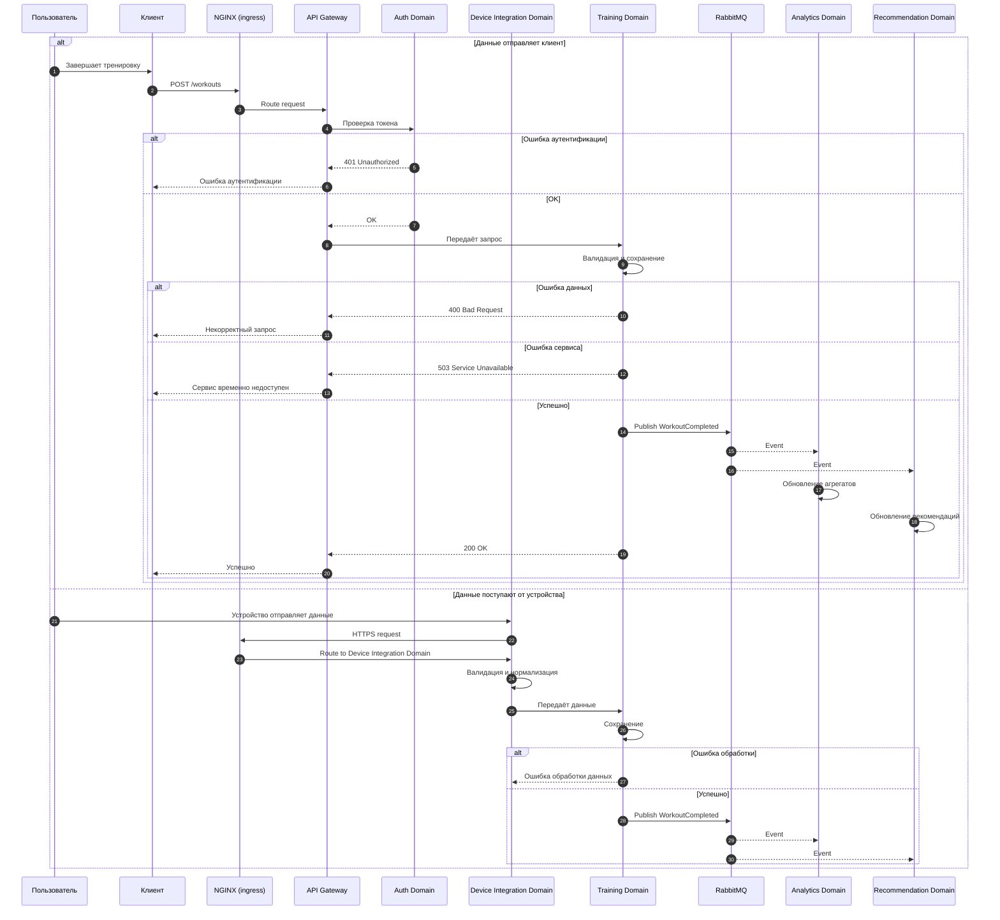

# Use Case 02 — Запись тренировки

## Описание

Сценарий описывает процесс получения и сохранения данных тренировки от пользователя или устройства с последующей асинхронной обработкой и агрегацией.

Сценарий является ключевым для бизнес-ценности платформы, так как формирует основную пользовательскую активность и данные для аналитики и рекомендаций.

---

## Цель сценария

Обеспечить:

- приём данных тренировки от клиента или устройства;
- надёжное сохранение в транзакционном контуре (Training Domain);
- публикацию события для последующей обработки;
- обновление аналитических агрегатов и рекомендаций.

---

## Участники

- Пользователь;
- Клиент (мобильное или веб-приложение);
- API Gateway (шлюз API);
- Auth Domain (домен аутентификации);
- Training Domain (домен тренировок);
- Device Integration Domain (домен интеграции устройств);
- Event Broker (RabbitMQ — брокер сообщений);
- Analytics Domain (аналитический домен);
- Recommendation Domain (домен рекомендаций).

---

## Предусловия

- пользователь аутентифицирован для клиентского сценария (валидный токен);
- устройство или интеграционный канал доверены системе для сценария передачи данных от устройства;
- сервисы доступны;
- клиент или устройство способны отправить данные тренировки;
- соблюдены требования безопасности (HTTPS/TLS для внешних вызовов).

---

## Основной поток

1. Пользователь завершает тренировку или устройство формирует данные о тренировке.
2. Если данные отправляются клиентским приложением:
   - клиент передаёт запрос через NGINX (ingress — входной контур) в API Gateway, который маршрутизирует его в Training Domain;
   - API Gateway выполняет аутентификацию и авторизацию в Auth Domain.
3. Если данные поступают от устройства, они сначала передаются через NGINX (ingress — входной контур) в Device Integration Domain.
4. Device Integration Domain:
   - принимает входящие данные устройства;
   - валидирует и нормализует формат;
   - передаёт подготовленные данные в Training Domain;
   - проверяет источник и доверенность интеграции устройства.
5. Training Domain:
   - валидирует входные данные;
   - нормализует формат;
   - сохраняет тренировку в своей базе данных.
6. Training Domain публикует событие `WorkoutCompleted` в Event Broker (RabbitMQ).
7. Event Broker (RabbitMQ) доставляет событие сервисам-подписчикам.
8. Analytics Domain:
   - принимает событие;
   - обновляет агрегированные показатели.
9. Recommendation Domain:
   - использует обновлённые данные для формирования рекомендаций.

---

## Альтернативные потоки

### A1. Ошибка входных данных

Если данные тренировки некорректны, запрос отклоняется.

- HTTP status: 400 Bad Request;
- Message: Некорректный запрос.

---

### A2. Ошибка аутентификации

Если токен отсутствует или невалиден, запрос отклоняется.

- HTTP status: 401 Unauthorized;
- Message: Ошибка аутентификации.

---

### A3. Ошибка внутренних сервисов

Если Training Domain или зависимые сервисы недоступны:

- HTTP status: 503 Service Unavailable;
- Message: Сервис временно недоступен.

---

### A4. Сбой обработки события

Если публикация или обработка события в Event Broker временно невозможна:

- событие может быть повторно отправлено (retry);
- используется механизм гарантированной доставки (at-least-once delivery — как минимум одна доставка);
- система остаётся согласованной с задержкой (eventual consistency — согласованность с задержкой).

---

### A5. Ошибка интеграционного канала устройства

Если данные от устройства некорректны, или источник не прошёл проверку доверенности:

- Device Integration Domain отклоняет данные;
- внешний HTTP-ответ пользователю не формируется;
- ошибка фиксируется во внутренних логах и системах наблюдаемости.

---

## Постусловия

- данные тренировки сохранены в Training Domain;
- событие опубликовано в Event Broker (RabbitMQ);
- аналитические агрегаты обновлены асинхронно;
- рекомендации могут быть обновлены.

---

## Архитектурные аспекты

Сценарий подтверждает следующие решения:

- внешний пользовательский и интеграционный трафик проходит через NGINX (ingress — входной контур), который направляет клиентские запросы в API Gateway, а device-трафик — в Device Integration Domain;
- разделение транзакционного и аналитического контуров (ADR-004);
- использование Event Broker (RabbitMQ) для асинхронной обработки (ADR-003);
- независимое масштабирование доменов (ADR-007);
- централизованная аутентификация (ADR-006);
- запрещён прямой доступ к базе данных другого домена (no cross DB access — запрет прямого доступа к чужой базе данных).

Связанные ADR:

- ADR-001 — архитектурный стиль;
- ADR-002 — доменная декомпозиция;
- ADR-003 — интеграции;
- ADR-004 — данные;
- ADR-006 — безопасность;
- ADR-007 — деплой и масштабирование.

---

## Диаграмма последовательности

---

## Вывод

Сценарий записи тренировки демонстрирует ключевой event-driven поток платформы Athletica и подтверждает необходимость разделения доменов, асинхронной обработки и масштабируемой архитектуры.
