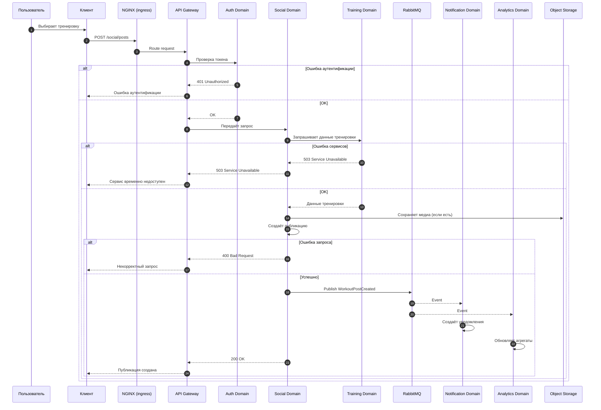

# Use Case 03 — Публикация результата тренировки в социальную ленту

## Описание

Сценарий описывает процесс публикации пользователем результата тренировки в социальную ленту платформы Athletica с последующей доставкой уведомлений подписчикам и обновлением социальной активности.

Сценарий объединяет транзакционный пользовательский запрос и асинхронную обработку событий, поэтому хорошо демонстрирует совместную работу API (интерфейс программирования приложений), API Gateway (шлюз API) и Event Broker (RabbitMQ — брокер сообщений).

---

## Цель сценария

Обеспечить пользователю возможность:

- опубликовать результат завершённой тренировки;
- отобразить публикацию в социальной ленте;
- уведомить подписчиков о новой активности;
- зафиксировать событие для последующей аналитической обработки.

---

## Участники

- Пользователь;
- Клиент (мобильное или веб-приложение);
- API Gateway (шлюз API);
- Auth Domain (домен аутентификации);
- Social Domain (домен социальных взаимодействий);
- Training Domain (домен тренировок);
- Event Broker (RabbitMQ — брокер сообщений);
- Notification Domain (домен уведомлений);
- Analytics Domain (аналитический домен);
- Object Storage (S3-compatible объектное хранилище);

---

## Предусловия

- пользователь аутентифицирован;
- в системе существует завершённая тренировка, которую пользователь имеет право публиковать;
- API Gateway, Social Domain, Training Domain и Notification Domain доступны;
- для внешнего взаимодействия используются HTTPS (защищённый HTTP) и TLS (Transport Layer Security — протокол шифрования транспортного уровня).

---

## Основной поток

1. Пользователь выбирает завершённую тренировку и инициирует публикацию результата.
2. Клиент отправляет запрос через NGINX (ingress — входной контур) в API Gateway, который маршрутизирует его в Social Domain.
3. API Gateway (шлюз API):
   - выполняет проверку токена в Auth Domain;
   - при успешной аутентификации передаёт запрос дальше;
   - при ошибке аутентификации отклоняет запрос.
4. Social Domain принимает запрос на публикацию.
5. Social Domain запрашивает в Training Domain данные тренировки, доступные для публикации.
6. Training Domain возвращает необходимые данные о тренировке.
7. Social Domain:
   - формирует публикацию;
   - при наличии медиа-файлов сохраняет их в Object Storage;
   - сохраняет метаданные публикации в своей базе данных;
   - связывает публикацию с пользователем и тренировкой.
8. Social Domain публикует событие `WorkoutPostCreated` в Event Broker (RabbitMQ).
9. Event Broker (RabbitMQ) доставляет событие сервисам-подписчикам.
---

### A5. Ошибка доступа к тренировке

Если пользователь не имеет права публиковать выбранную тренировку:

- HTTP status: 400 Bad Request;
- Message: Некорректный запрос.

---
10. Notification Domain получает событие и создаёт уведомления для подписчиков.
11. Analytics Domain получает событие и учитывает его в социальной и продуктовой аналитике.
12. Клиент получает успешный ответ о публикации.

---

## Альтернативные потоки

### A1. Ошибка пользовательского запроса

Если публикация не может быть создана из-за некорректного запроса или нарушения правил публикации, система возвращает обобщённую ошибку.

- HTTP status: 400 Bad Request;
- Message: Некорректный запрос.

---

### A2. Ошибка аутентификации

Если пользователь не аутентифицирован или токен недействителен, запрос отклоняется.

- HTTP status: 401 Unauthorized;
- Message: Ошибка аутентификации.

---

### A3. Ошибка внутренних сервисов

Если Social Domain, Training Domain или Notification Domain недоступны, клиент получает сообщение о временной недоступности сервиса.

- HTTP status: 503 Service Unavailable;
- Message: Сервис временно недоступен.

---

### A4. Ошибка асинхронной доставки события

Если после создания публикации событие не может быть сразу доставлено подписчикам:

- публикация остаётся сохранённой в Social Domain;
- Event Broker выполняет повторную доставку события;
- уведомления и аналитика обновляются асинхронно;
- система сохраняет eventual consistency (согласованность с задержкой).

---

## Постусловия

При успешном завершении сценария:

- публикация сохранена в Social Domain;
- событие публикации отправлено в Event Broker;
- Notification Domain может создать уведомления подписчикам;
- Analytics Domain может обработать событие для аналитики;
- пользователь видит публикацию в социальной ленте.

---

## Архитектурные аспекты

Сценарий подтверждает следующие архитектурные решения:

- взаимодействие между доменами выполняется через API (через API Gateway) и Event Broker (RabbitMQ) согласно ADR-003;
 - внешний пользовательский трафик проходит через NGINX (ingress — входной контур), который направляет запросы в API Gateway;
- Social Domain не имеет прямого доступа к данным Training Domain и получает данные только через контракт взаимодействия;
- публикация результата реализуется как транзакция в Social Domain с последующей асинхронной fan-out обработкой (распространение события на несколько подписчиков);
- уведомления и аналитика обновляются асинхронно и не блокируют пользовательский ответ;
- данные Social Domain и Training Domain разделены согласно стратегии Database per Service (отдельная база данных на сервис);
- медиа-данные публикаций выносятся в Object Storage (S3-compatible) и не хранятся в транзакционной базе данных;
- внешнее взаимодействие осуществляется через защищённые протоколы HTTPS (защищённый HTTP) и TLS (Transport Layer Security — протокол шифрования транспортного уровня).

Связанные ADR:

- ADR-001 — Выбор архитектурного стиля системы;
- ADR-002 — Декомпозиция системы на домены;
- ADR-003 — Выбор интеграционного подхода;
- ADR-004 — Стратегия хранения данных;
- ADR-005 — Стратегия наблюдаемости системы;
- ADR-006 — Стратегия безопасности системы;
- ADR-007 — Стратегия развёртывания и масштабирования.

---

## Диаграмма последовательности

---

## Вывод

Сценарий публикации результата тренировки в социальную ленту показывает, как в Athletica сочетаются синхронный пользовательский запрос, доменная изоляция, асинхронная доставка событий и fan-out обработка уведомлений. 
Он подтверждает корректность выбранной архитектуры для социальных функций платформы.
