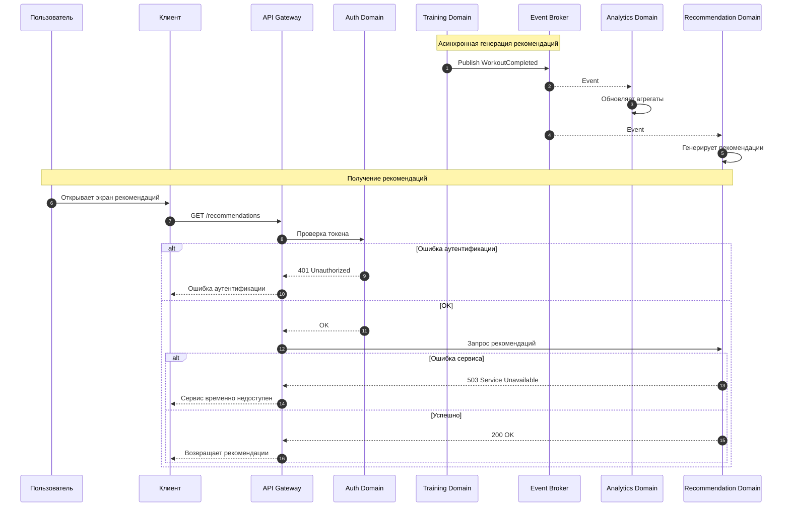

# Use Case 04 — Генерация персональных рекомендаций

## Описание

Сценарий описывает процесс формирования персональных рекомендаций пользователю на основе его активности, истории тренировок и аналитических данных.

Сценарий сочетает асинхронную генерацию рекомендаций (asynchronous — асинхронный) и синхронное получение уже подготовленных рекомендаций пользователем, демонстрируя работу аналитического контура системы Athletica.

---

## Цель сценария

Обеспечить:

- анализ пользовательской активности;
- формирование персонализированных рекомендаций;
- обновление рекомендаций без блокировки пользовательских запросов;
- подготовку данных для будущих моделей машинного обучения (Machine Learning — машинное обучение).

---

## Участники

- Пользователь;
- Client (мобильное или веб-приложение);
- API Gateway (шлюз API);
- Auth Domain (домен аутентификации);
- Recommendation Domain (домен рекомендаций);
- Analytics Domain (аналитический домен);
- Training Domain (домен тренировок);
- Event Broker (брокер событий).

---

## Предусловия

- пользователь зарегистрирован в системе;
- в системе есть данные о тренировках пользователя;
- аналитические агрегаты доступны;
- Event Broker функционирует;
- соблюдены требования безопасности (HTTPS/TLS для внешних вызовов).

---

## Основной поток

### Часть 1. Генерация рекомендаций (асинхронно)

1. Пользователь выполняет действия (например, завершает тренировку).
2. Training Domain публикует событие `WorkoutCompleted` в Event Broker.
3. Event Broker доставляет событие сервисам-подписчикам.
4. Analytics Domain:
   - принимает событие;
   - обновляет агрегированные показатели пользователя.
5. Recommendation Domain:
   - получает событие из Event Broker;
   - анализирует:
     - историю тренировок;
     - текущую активность;
     - пользовательские цели;
   - формирует персональные рекомендации;
   - сохраняет их в своей базе данных.

---

### Часть 2. Получение рекомендаций (синхронно)

1. Пользователь открывает экран рекомендаций.
2. Client отправляет запрос через API Gateway.
3. API Gateway выполняет аутентификацию через Auth Domain.
4. API Gateway передаёт запрос в Recommendation Domain.
5. Recommendation Domain возвращает готовые рекомендации.
6. Client отображает рекомендации пользователю.

---

## Альтернативные потоки

### A1. Ошибка аутентификации

Если пользователь не аутентифицирован:

- HTTP status: 401 Unauthorized;
- Message: Ошибка аутентификации.

---

### A2. Ошибка пользовательского запроса

Если запрос сформирован некорректно:

- HTTP status: 400 Bad Request;
- Message: Некорректный запрос.

---

### A3. Ошибка внутренних сервисов

Если Recommendation Domain недоступен при запросе рекомендаций:

- HTTP status: 503 Service Unavailable;
- Message: Сервис временно недоступен.

---

### A4. Задержка обновления рекомендаций

Если аналитические данные ещё не обработаны:

- пользователь получает предыдущую версию рекомендаций;
- система остаётся согласованной в конечном итоге (eventual consistency — согласованность в конечном итоге);
- новые рекомендации появятся после обработки событий.

---

### A5. Отсутствие рекомендаций

Если рекомендации ещё не сформированы или пользователь новый:

- система возвращает пустой список или базовые рекомендации;
- HTTP status: 200 OK.

---

## Постусловия

- рекомендации сформированы и сохранены;
- пользователь получает актуальные или последние доступные рекомендации;
- аналитические данные обновлены или поставлены в асинхронную обработку;
- система остаётся консистентной на уровне eventual consistency.

---

## Архитектурные аспекты

Сценарий подтверждает следующие решения:

- разделение транзакционного и аналитического контуров (ADR-004);
- использование Event Broker для асинхронной обработки (ADR-003);
- отсутствие блокировки пользовательских запросов аналитикой;
- хранение рекомендаций отдельно от транзакционных данных;
- запрещён прямой доступ к базе данных другого домена (no cross DB access — запрет прямого доступа к чужой базе данных);
- использование eventual consistency как базовой модели согласованности;
- внешнее взаимодействие осуществляется через защищённые протоколы HTTPS (защищённый HTTP) и TLS (Transport Layer Security — протокол шифрования транспортного уровня).

Связанные ADR:

- ADR-001 — архитектурный стиль;
- ADR-002 — доменная декомпозиция;
- ADR-003 — интеграции;
- ADR-004 — данные;
- ADR-005 — наблюдаемость;
- ADR-006 — безопасность;
- ADR-007 — масштабирование.

---

## Диаграмма последовательности

---

## Вывод

Сценарий генерации рекомендаций демонстрирует архитектурный переход от синхронной обработки пользовательских запросов к асинхронной аналитике. Он подтверждает корректность разделения доменов, использование Event Broker и модель eventual consistency как основу масштабируемой системы Athletica.
