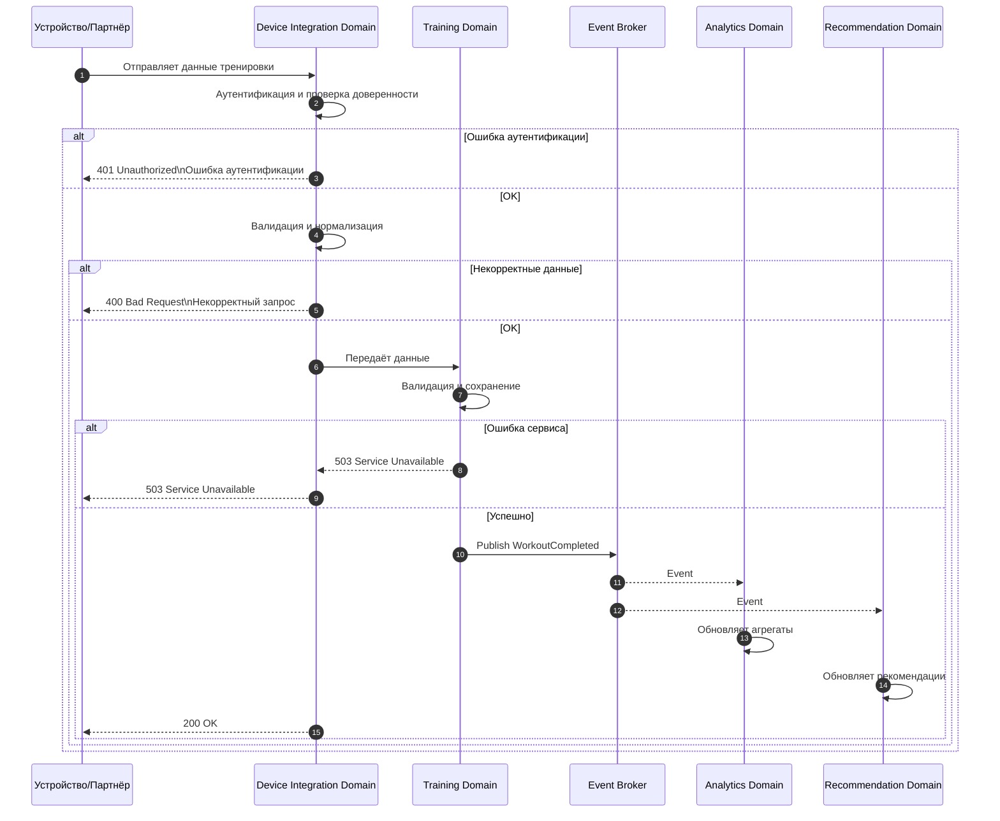

# Use Case 05 — Интеграция с устройствами (Device Integration)

## Описание

Сценарий описывает процесс приёма, валидации и обработки данных тренировок, поступающих от внешних устройств (wearables — носимые устройства) и интеграционных партнёров.

Сценарий демонстрирует отдельный входной контур (ingestion — приём данных), отличающийся от клиентского API, и последующую асинхронную обработку через Event Broker (брокер событий).

---

## Цель сценария

Обеспечить:

- безопасный приём данных от устройств и партнёров;
- валидацию и нормализацию входящих данных;
- передачу данных в Training Domain (домен тренировок);
- публикацию событий для аналитики и рекомендаций;
- устойчивость к сбоям и повторную обработку (retry — повторная попытка).

---

## Участники

- Устройство / Партнёр (внешний источник данных);
- Device Integration Domain (домен интеграции устройств);
- Training Domain (домен тренировок);
- Event Broker (брокер событий);
- Analytics Domain (аналитический домен);
- Recommendation Domain (домен рекомендаций);

---

## Предусловия

- источник данных зарегистрирован и доверен системе (доверенный интеграционный канал);
- настроены ключи/секреты или иной механизм аутентификации интеграции;
- Device Integration Domain доступен;
- Training Domain доступен;
- Event Broker функционирует;
- внутренний контур изолирован от внешнего доступа;
- для внешних вызовов используются HTTPS (защищённый HTTP) и TLS (Transport Layer Security — протокол шифрования транспортного уровня).

---

## Основной поток

1. Устройство или партнёр формирует пакет данных о тренировке.
2. Источник отправляет данные в Device Integration Domain.
3. Device Integration Domain:
   - аутентифицирует источник (по ключу/подписи/сертификату);
   - проверяет доверенность интеграции;
   - валидирует структуру данных;
   - нормализует формат данных.
4. Device Integration Domain передаёт подготовленные данные в Training Domain.
5. Training Domain:
   - валидирует доменные ограничения;
   - сохраняет тренировку в своей базе данных.
6. Training Domain публикует событие `WorkoutCompleted` в Event Broker.
7. Event Broker доставляет событие сервисам-подписчикам.
8. Analytics Domain:
   - принимает событие;
   - обновляет агрегированные показатели.
9. Recommendation Domain:
   - получает событие;
   - обновляет или формирует рекомендации асинхронно.

---

## Альтернативные потоки

### A1. Ошибка аутентификации источника

Если источник не прошёл аутентификацию:

- Device Integration Domain отклоняет запрос;
- внешний ответ: 401 Unauthorized (обобщённый ответ);
- Message: Ошибка аутентификации.

---

### A2. Некорректные данные

Если данные не проходят валидацию или не соответствуют ожидаемому формату:

- Device Integration Domain отклоняет данные;
- внешний ответ: 400 Bad Request (обобщённый ответ);
- Message: Некорректный запрос.

---

### A3. Ошибка внутренних сервисов

Если Training Domain или иная внутренняя зависимость недоступны:

- внешний ответ: 503 Service Unavailable;
- Message: Сервис временно недоступен;

---

### A4. Сбой доставки события

Если публикация или доставка события в Event Broker временно невозможна:

- используется механизм повторной доставки (retry);
- применяется стратегия at-least-once delivery (как минимум одна доставка);
- система достигает eventual consistency (согласованность в конечном итоге).

---

### A5. Дублирование данных

Если устройство отправляет повторный пакет данных:

- система выполняет дедупликацию (deduplication — устранение дубликатов);
- данные либо игнорируются, либо обновляют существующую запись согласно правилам домена;
- внешний ответ остаётся успешным (идемпотентность — idempotency).

---

## Постусловия

- данные тренировки сохранены в Training Domain;
- событие опубликовано в Event Broker;
- аналитика обновлена или поставлена в асинхронную обработку;
- рекомендации могут быть обновлены;
- система остаётся консистентной на уровне eventual consistency.

---

## Архитектурные аспекты

Сценарий подтверждает следующие решения:

- наличие отдельного ingestion-контура для внешних устройств;
- разграничение аутентификации: устройства используют интеграционную аутентификацию, отличную от пользовательской (Auth Domain);
- использование Event Broker для асинхронной обработки (ADR-003);
- разделение доменов и хранение данных по стратегии Database per Service (ADR-004);
- запрещён прямой доступ к базе данных другого домена (no cross DB access — запрет прямого доступа к чужой базе данных);
- поддерживается идемпотентность (idempotency — свойство повторного выполнения без изменения результата) и дедупликация для устойчивости интеграций;
- внешнее взаимодействие осуществляется через защищённые протоколы HTTPS (защищённый HTTP) и TLS (Transport Layer Security — протокол шифрования транспортного уровня).
- используется correlation-id (идентификатор корреляции) для трассировки запросов и анализа инцидентов.

Связанные ADR:

- ADR-001 — архитектурный стиль;
- ADR-002 — доменная декомпозиция;
- ADR-003 — интеграции;
- ADR-004 — данные;
- ADR-005 — наблюдаемость;
- ADR-006 — безопасность;
- ADR-007 — масштабирование.

---

## Диаграмма последовательности

---

## Вывод

Сценарий интеграции устройств завершает архитектурную картину Athletica, вводя отдельный контур приёма данных и демонстрируя устойчивую event-driven модель обработки. Он подчёркивает различие между пользовательскими и интеграционными потоками, необходимость идемпотентности и асинхронной обработки для масштабируемой системы.
